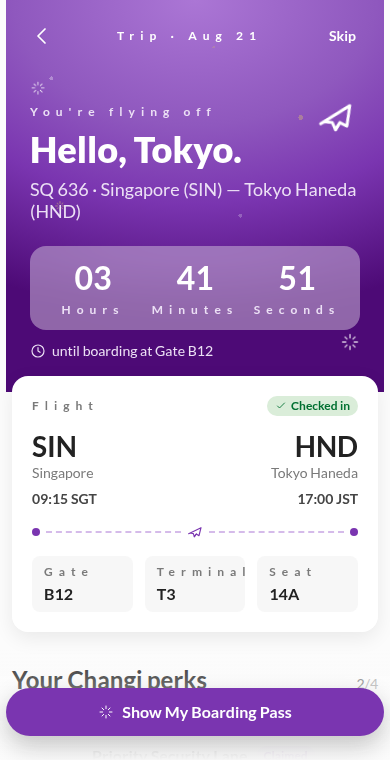
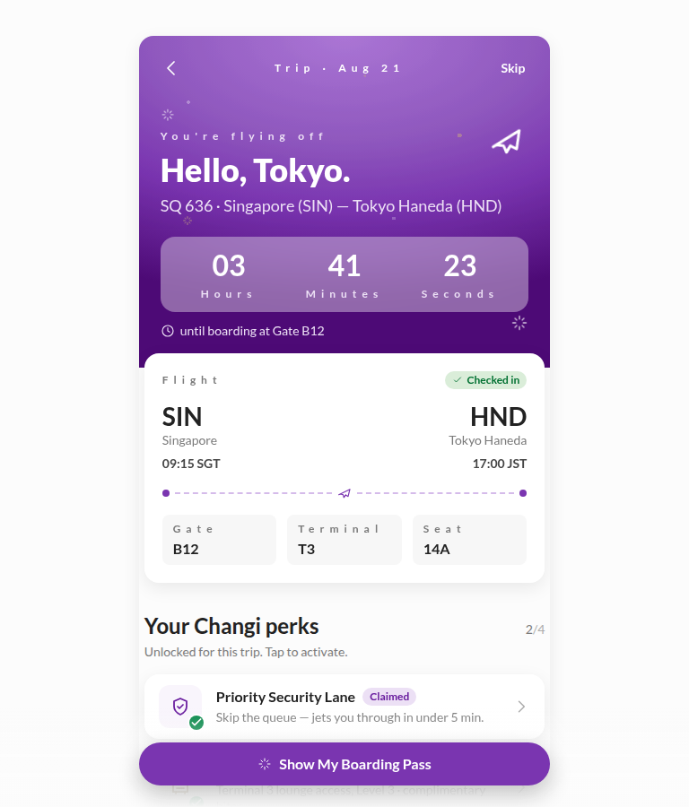
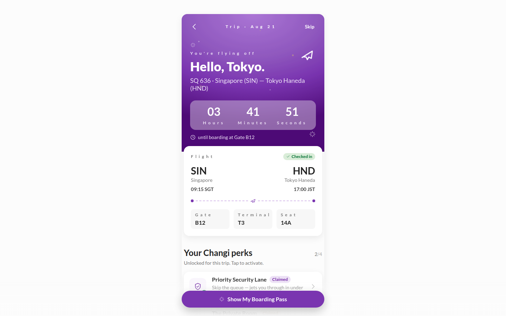

# PAX Onboarding — Airport Perks

A **Runway DLS** reference prototype for a fun, customer-facing (PAX) onboarding
screen: the moment right after check-in when a passenger discovers where
they're flying and which Changi Airport perks they've unlocked for this trip.

Follows the **Customer-Facing / PAX** profile from
[`SKILL.md § 10`](../../SKILL.md):

- Sole typeface: **Lato** (loaded from Google Fonts in `index.html`).
- H1: Lato Black 36 px / 42 px.
- Primary interactive colour: `Colors/Purple Primary/600`.
- Primary CTA radius: `radius-full`.
- Bottom page margin: `spacing-80`.
- Output: interactive prototype in **React + Tailwind** (Vite + TypeScript).

## Screen

Single screen, mobile-first, presented as a phone-style card on tablet/desktop.

### Column mapping

| Breakpoint | Grid | Margin | Gutter | Screen span |
| --- | --- | --- | --- | --- |
| Mobile (375 px) | 4-col | 6 px | 16 px | col 1–4 (full-width sections) |
| Tablet (768 px) | 6-col | 32 px | 32 px | phone frame centred, `max-w-[420px]` |
| Desktop (1280 px) | 12-col | 80 px | 32 px | phone frame centred, `max-w-[420px]` |

### Sections

1. **Top bar** — Back / trip label / Skip. On the purple hero, text is white.
2. **Hero** — Purple Primary radial gradient with a subtle confetti pattern
   and animated sparkle + plane SVGs. Reveals destination (H1: "Hello,
   Tokyo.") and countdown to boarding.
3. **Flight card** — Overlaps the hero (elevation `shadow-light-bg`), shows
   origin/destination, gate / terminal / seat.
4. **Perks list** — Four cards (Priority Security Lane, The Private Room,
   S$20 dining voucher, 10% off retail). Each row is tappable to toggle
   claimed state; a green tick badge overlays claimed perks.
5. **Sticky CTA** — "Show My Boarding Pass" primary button
   (`Purple Primary/600`, `radius-full`, min width 240 px per Buttons spec).

### Tokens used (verbatim from SKILL.md / extended palette)

- Colours: `Colors/Grey/25` `50` `100` `300` `500` `700` `800` `900`,
  `Colors/Base/White`, `Colors/Purple Primary/100` `200` `300` `500` `600`
  `700`, `Colors/Green Success/200` `600` `700`, `Colors/Gold/100` `200`
  `500` `800`, `Colors/Iris blue/200` `600`, `Colors/Teal/200` `600`.
- Alpha overlays: `Grey/10% Light #FCFCFC`, `Grey/20% Light #FCFCFC`.
- Typography: `H1` (PAX Black override), `H4`, `H5`, `Subheading`,
  `Body Default`, `Body Small`, `Small Text / Tag`, `All Caps Caption`.
- Spacing: `spacing-2` `4` `6` `8` `12` `16` `20` `24` `32` `40` `80`.
- Radius: `radius-xs`, `radius-sm`, `radius-md`, `radius-lg`, `radius-full`.
- Shadows: `shadow-light-bg`, `shadow-dark-bg`.
- Rings: `ring-brand` (2 px focus outline).
- Blur: `backdrop-light-blur-md` for the countdown chip on the hero.

## Preview

| Mobile (375 px) | Tablet (768 px) | Desktop (1440 px) |
| --- | --- | --- |
|  |  |  |

## Run locally

```bash
cd prototypes/pax-onboarding-perks
npm install
npm run dev
```

Open <http://localhost:5173>.

To build & preview the production bundle:

```bash
npm run build
npm run preview
```

## Icon policy

The DLS forbids emoji in generated UI and no official CAG icon set is
bundled in this workspace. All icons in this prototype are inline SVGs
under `src/icons.tsx`, drawn with `currentColor` so DLS tokens remain the
single source of colour.
